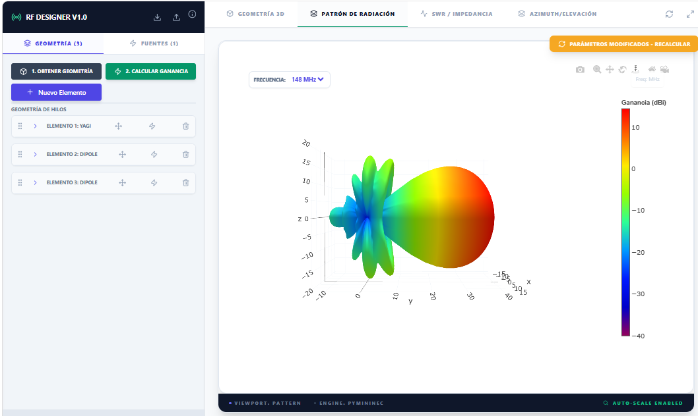
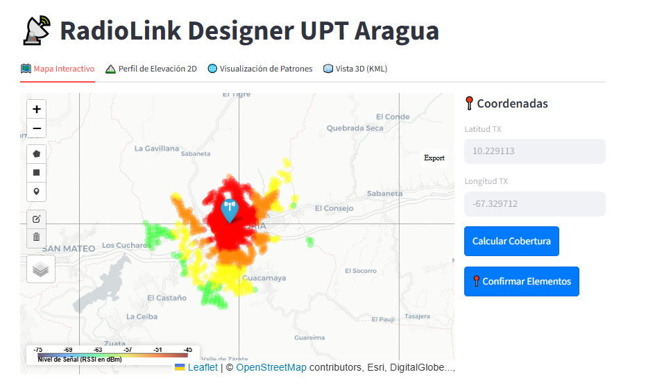
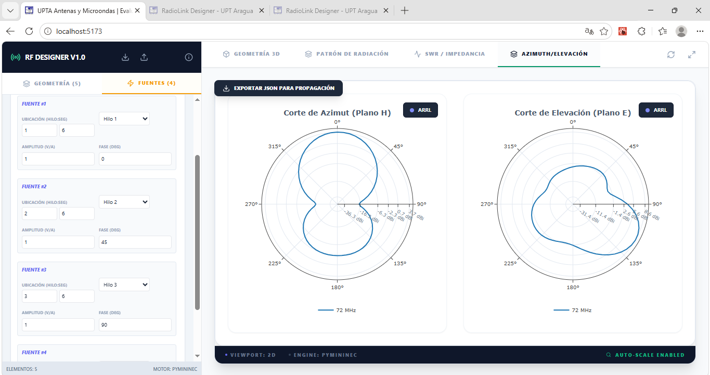
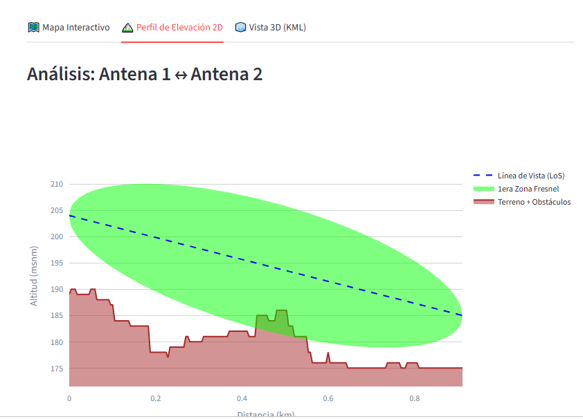

# 📡 UPTA Antenna Suite

> **Software de ingeniería de antenas y planificación de radioenlaces**  
> Simulación numérica de patrones de radiación (MiniNEC) + Análisis de cobertura RF con modelos de terreno real.


---

## 📋 Tabla de Contenidos

- [Descripción General](#-descripción-general)
- [Arquitectura del Proyecto](#-arquitectura-del-proyecto)
- [Capturas de Pantalla](#-capturas-de-pantalla)
- [Instalación — Ejecutable Windows](#-instalación--ejecutable-windows)
- [Instalación — Docker](#-instalación--docker)
- [Instalación — Código Fuente](#-instalación--código-fuente)
- [Documentación de la API](#-documentación-de-la-api)
- [Estructura del Repositorio](#-estructura-del-repositorio)
- [Contribuir](#-contribuir)

---

## 🔭 Descripción General

**UPTA Antenna Suite** está compuesto por dos herramientas complementarias:

| Herramienta | Tecnología | Descripción |
|---|---|---|
| **Simulador de Antenas** | FastAPI + React | Motor numérico MiniNEC para calcular patrones de radiación 3D, impedancias y SWR. Diseño CAD de geometrías de antena. |
| **Planificador RF** | Streamlit | Análisis de radioenlaces PTP, mapas de cobertura con elevación real de terreno, balance de enlace y zonas de Fresnel. |

### Funcionalidades principales

- 🧮 **Simulación numérica MiniNEC** — patrones 3D, ARRL, cortes azimuth/elevación
- 📊 **SWR e Impedancia** — barrido en frecuencia con gráficas de red
- 🗺️ **Mapas de cobertura RF** — integración con datos de elevación SRTM
- 📡 **Balance de enlace PTP** — FSPL, Fresnel, EIRP, margen de desvanecimiento
- 📐 **Editor 3D** — diseño de dipolo, Yagi, parábola, helicoidal y geometría libre
- 🌍 **Exportación KML** — visualización en Google Earth
- 🐳 **Despliegue Docker** — entorno reproducible multiplataforma

---

## 🏗️ Arquitectura del Proyecto

```
UPTA-Antenna-Suite/
│
├── streamlit/                  # Planificador RF
│   ├── app.py                  # Aplicación principal Streamlit
│   ├── pyhigh/                 # Módulo de elevación de terreno (SRTM)
│   └── hgtdata/                # Datos de elevación HGT (no incluidos en repo)
│
├── backend/                    # API del Simulador de Antenas
│   ├── main.py                 # FastAPI + uvicorn
│   ├── submininec/             # Motor numérico MiniNEC (Python)
│   └── subplot_antenna/        # Utilidades de visualización de patrones
│
├── frontend/                   # Interfaz CAD del Simulador
│   ├── src/
│   │   ├── App.jsx             # Componente raíz
│   │   └── components/         # Sidebar, Viewer, modales, visores
│   ├── package.json
│   └── tailwind.config.js
```

**Flujo de datos:**

```
Usuario (Browser/Streamlit)
       │
       ▼
  Frontend React  ──POST /api/simulate──►  FastAPI Backend
       │                                        │
       │◄──────── JSON (patrones, SWR) ─────────┤
       │                                   submininec
       ▼                                  (Motor MiniNEC)
  Viewer 3D / Gráficas Plotly
```

---

## 📸 Capturas de Pantalla

> **Nota:** Añade capturas reales en la carpeta `docs/screenshots/` y actualiza los paths abajo.

| Simulador de Antenas | Planificador RF |
|:---:|:---:|
|  |  |
| *Editor + Patrón 3D* | *Mapa de cobertura con RSSI* |

| Corte Azimuth / Elevación | Balance de Enlace PTP |
|:---:|:---:|
|  |  |
| *Patrones 2D polares* | *Perfil de Fresnel y balance* |

---

## 🪟 Instalación — Ejecutable Windows

La forma más rápida de usar UPTA Antenna Suite sin instalar nada.

### Requisitos previos
- Windows 10 / 11 (64-bit)
- Sin dependencias adicionales — todo incluido en el ejecutable

### Pasos

**1. Descarga los archivos** desde la página de [Releases](https://github.com/freddy-debug-ve/upta-antenna-suite/releases/latest):

**2. Descomprime el .zip en una ruta o directorio de trabajo**

**3. Abre Start.exe**

**4. Inicia el aplicativo a utilizar (o ambos)**

**5. Accede con el navegador a http://localhost:8000 o http://localhost:8501**


> ⚠️ **Windows Defender SmartScreen** puede mostrar una advertencia la primera vez. Haz clic en *"Más información" → "Ejecutar de todas formas"*. Los ejecutables están generados con PyInstaller desde el código fuente de este repositorio.

### Datos de elevación (Planificador RF)

Los datos HGT no están incluidos.

Coloca los archivos `.hgt.zip` en la carpeta `hgtdata/`.

---

## 🐍 Instalación — Código Fuente

### Requisitos previos

- Python 3.10 o superior
- Node.js 18+ y npm
- Git

### 1. Clonar el repositorio

```bash
git clone https://github.com/freddy-debug-ve/upta-antenna-suite.git
cd upta-antenna-suite
```

### 2. Backend — Simulador de Antenas

```bash
cd backend

# Crear entorno virtual
python -m venv venv
venv\Scripts\activate          # Windows
# source venv/bin/activate     # Linux/macOS

# Instalar dependencias
pip install -r requirements.txt

# Iniciar el servidor
python main.py
# API disponible en http://localhost:8000
```

### 3. Frontend — Simulador de Antenas

```bash
cd frontend

# Instalar dependencias
npm install

# Modo desarrollo
npm run dev
# Interfaz en http://localhost:5173

# Build de producción (sirve desde el backend)
npm run build
# Los archivos se generan en frontend/dist/
```

### 4. Planificador RF (Streamlit)

```bash
cd streamlit

# Crear entorno virtual (puede compartirse con backend)
python -m venv venv
venv\Scripts\activate

pip install -r requirements.txt

# Iniciar
streamlit run app.py
# Disponible en http://localhost:8501
```

### Requirements

**`backend/requirements.txt`**
```
fastapi
uvicorn[standard]
numpy
sympy
pydantic
```

**`streamlit/requirements.txt`**
```
streamlit
folium
streamlit-folium
numpy
pandas
plotly
pydeck
shapely
geopy
simplekml
matplotlib
branca
Pillow
```

---
 
## 🐳 Instalación — Docker
 
La opción recomendada para entornos de producción o despliegue en servidor. Todos los servicios se orquestan con Docker Compose y se exponen a través de un **gateway Nginx** en un único puerto.
 
### Requisitos previos
 
- [Docker Desktop](https://www.docker.com/products/docker-desktop/) (Windows/Linux/macOS)
- Docker Compose v2+
### Inicio rápido

Descarga el archivo UPT_Antenna_Suite_for_Docker.zip desde la página de [Releases](https://github.com/freddy-debug-ve/upta-antenna-suite/releases/latest):

Descomprime en upta-antena-suite

Luego ejecuta:
 
```bash
cd upta-antena-suite
 
# Construir y levantar todos los servicios
docker compose up --build
```
 
Una vez iniciado, abre el navegador en:
 
| Ruta | Descripción |
|---|---|
| `http://localhost/` | Simulador de Antenas |
| `http://localhost/radiolink/` | Planificador RF |
 
> Todo el tráfico entra por el **puerto 80** a través del gateway Nginx, que enruta internamente a cada servicio.
 
### Arquitectura de contenedores
 
```
                        ┌─────────────────────────────────┐
Usuario → :80           │        gateway (Nginx)          │
                        │  nginx:alpine · nginx.conf      │
                        └──────┬──────────┬───────────────┘
                               │          │
              /radiolink/      │          │  /  y  /api/
                     ┌─────────▼──┐  ┌───▼──────────────────┐
                     │ radiolink  │  │       ant-one         │
                     │ Streamlit  │  │  Frontend React (:80) │
                     │   :8501    │  └───────────────────────┘
                     └────────────┘            │ /api/
                                      ┌────────▼────────┐
                                      │    antenna      │
                                      │  FastAPI :8000  │
                                      └─────────────────┘
```
 
### Detener los servicios
 
```bash
docker compose down
```

### Variables de entorno

Crea un archivo `.env` en la raíz si necesitas personalizar:

```env
# Puerto del simulador
BACKEND_PORT=8000

# Puerto del planificador
STREAMLIT_PORT=8501

# Ruta a datos HGT (dentro del contenedor)
HGT_DATA_PATH=/app/hgtdata
```

---

## 📖 Documentación de la API

El backend FastAPI genera documentación interactiva automáticamente.

Una vez iniciado el backend, accede a:
- **Swagger UI:** http://localhost:8000/docs
- **ReDoc:** http://localhost:8000/redoc

### Tipos de Elementos Soportados

| `type` | Descripción | Parámetros clave |
|---|---|---|
| `dipole` | Dipolo simple punto a punto | `p1`, `p2`, `radius` |
| `manual` | Geometría libre por tabla de hilos | `table[]` con `x1,y1,z1,x2,y2,z2,radius` |
| `parabola` | Reflector parabólico | `diam`, `fd`, `divA`, `divB` |
| `helix` | Antena helicoidal | `turns`, `pitch`, `radius`, `wire_r` |
| `yagi` | Arreglo Yagi-Uda | `boom_len`, `elements[]` |
| `free` | Geometría paramétrica (SymPy) | `expr_x`, `expr_y`, `expr_z`, `n_points` |

### Materiales disponibles (conductividad eléctrica)

| Clave | Material | Conductividad (S/m) |
|---|---|---|
| `COPPER` | Cobre | 5.8 × 10⁷ |
| `SILVER` | Plata | 6.3 × 10⁷ |
| `ALUMINUM` | Aluminio | 3.5 × 10⁷ |
| `STEEL` | Acero inoxidable | 1.4 × 10⁶ |
| `STEEL_GALVANIZED` | Acero galvanizado | 6.0 × 10⁶ |
| `BRASS` | Latón | 1.5 × 10⁷ |

---

## 📁 Estructura del Repositorio

```
.
├── backend/
│   ├── main.py                     # Punto de entrada FastAPI
│   ├── requirements.txt
│   ├── submininec/                 # Motor MiniNEC
│   │   ├── mininec.py
│   │   ├── pulse.py
│   │   ├── segment.py
│   │   └── ...
│   └── subplot_antenna/            # Utilidades de plot
│
├── frontend/
│   ├── src/
│   │   ├── App.jsx
│   │   ├── components/
│   │   │   ├── Sidebar.jsx         # Panel de control
│   │   │   ├── Viewer.jsx          # Visor principal
│   │   │   ├── PatternViewer.jsx   # Patrón 3D
│   │   │   ├── PolarViewer.jsx     # Cortes 2D
│   │   │   ├── SWRViewer.jsx       # Red / SWR
│   │   │   ├── OrthogonalEditor.jsx # CAD 2D
│   │   │   ├── CoordinateTable.jsx  # Tabla de hilos
│   │   │   └── ...
│   ├── package.json
│   └── tailwind.config.js
│
├── streamlit/
│   ├── app.py                      # Planificador RF
│   ├── requirements.txt
│   ├── pyhigh/                     # Elevación SRTM
│   └── hgtdata/                    # Archivos .hgt (no en repo)

│
├── docs/
│   └── screenshots/
│
├── .gitignore
└── README.md
```

---

## 🤝 Contribuir

1. Haz fork del repositorio
2. Crea una rama: `git checkout -b feature/nueva-funcionalidad`
3. Realiza tus cambios y haz commit: `git commit -m "feat: descripción"`
4. Push a tu fork: `git push origin feature/nueva-funcionalidad`
5. Abre un Pull Request

### Convención de commits

```
feat:     Nueva funcionalidad
fix:      Corrección de bug
docs:     Cambios en documentación
refactor: Refactorización sin cambio de comportamiento
chore:    Tareas de mantenimiento
```

---

## 📄 Licencia

Este proyecto está bajo la licencia MIT. Ver el archivo [LICENSE](LICENSE) para más detalles.

---

<div align="center">
  <strong>UPTA Antenna Suite</strong> — Desarrollado en la Universidad Politécnica Territorial de Aragua<br>
  <sub>Motor numérico basado en MiniNEC · Datos de terreno SRTM/HGT · Exportación NEC2/KML</sub>
</div>
